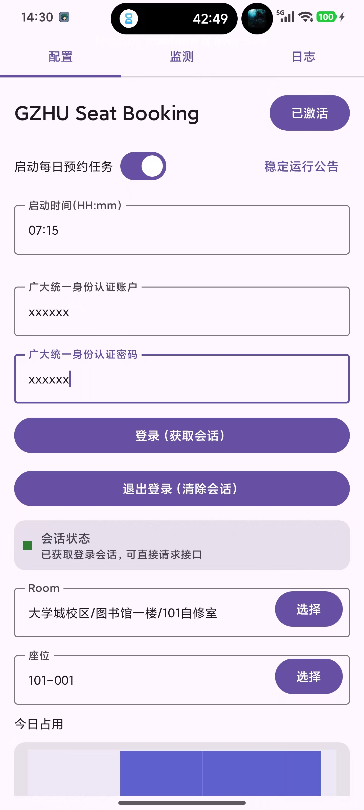
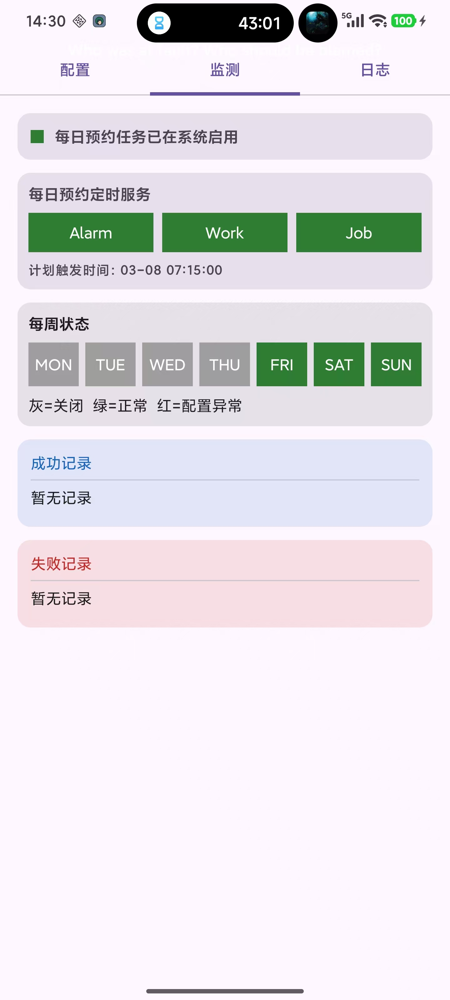
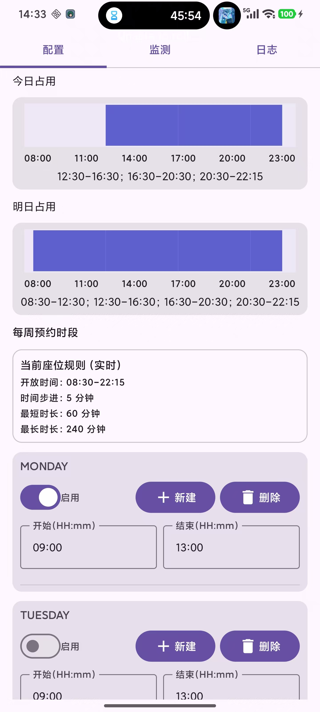
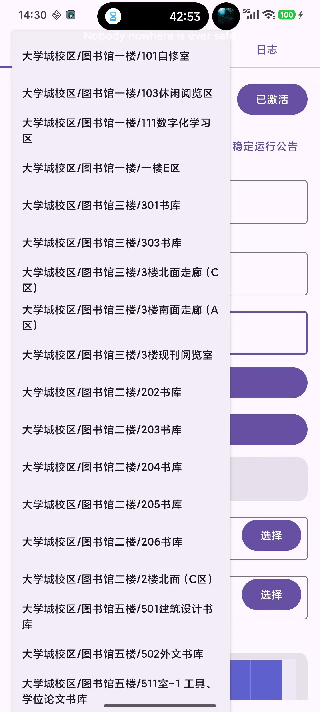
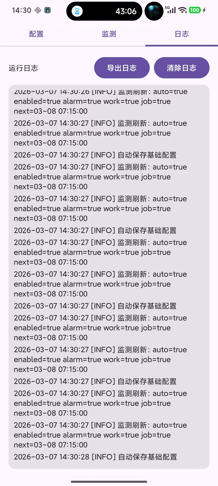

# 使用教程

## 1. 安装与系统设置

1. 安装 release 签名版 APK。
2. 允许通知权限（用于执行结果通知与日志导出通知）。
3. 建议关闭电池优化限制并允许后台运行、自启动。

## 2. 登录并获取会话

1. 打开 `配置` 页面。
2. 输入统一身份认证账号和密码。
3. 点击 `登录（获取会话）`。
4. 看到会话状态为“已获取登录会话，可直接请求接口”表示成功。

## 3. 选择房间与座位

1. 在 `Room` 下拉中选择目标自习室。
2. 在 `座位` 下拉中选择目标座位。
3. 切换到“今日占用 / 明日占用”确认座位时间分布。

## 4. 配置自动预约任务

1. 打开 `启动每日预约任务`。
2. 设置触发时间（例如 `07:15`）。
3. 在“每周预约时段”按需启用时段。

默认模板如下：

1. `09:00-13:00`
2. `13:00-16:00`
3. `16:00-20:00`
4. `20:00-22:15`
5. 第 5 条及之后为空时间段。

## 5. 在监测页检查任务是否生效

1. 打开 `监测` 页面。
2. 确认“每日预约任务已在系统启用”。
3. 确认 `Alarm / Work / Job` 三个通道均为绿色。
4. 核对“计划触发时间”是否正确。

## 6. 查看结果和日志

1. 检查成功记录与失败记录。
2. 打开 `日志` 页面导出 ZIP 日志或清空日志。

## 界面截图

### APP首页

用于登录获取会话、设置触发时间、开关自动预约，以及选择房间与座位。

### 监测页面

用于核对 `Alarm / Work / Job` 三通道状态、计划触发时间、每周状态颜色和执行记录。

### 座位配置

用于查看今日与明日占用情况，并配置每周预约时段。

### 房间树示意

用于展示图书馆房间层级结构，便于快速定位预约目标区域。

### 日志页面（新增）

用于导出日志 ZIP、清空日志，并辅助定位运行异常。
